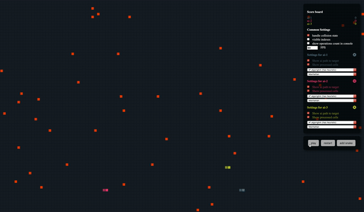

# Snake Game

[Try it](https://dmitryshelomanov.github.io/snake/)

## Introduction

Simple snake game with bot wich looking for shorter path to target

Your opportunities

- Toggle different settings
- Add self to game
- Add bricks to arbitrary place
- Use different search algorighms

Feature

- change FPS
- algorithm visualization

Notes

_Use keyword [/_ Note:](https://github.com/dmitryshelomanov/snake/search?q=%2F*+Note%3A&unscoped_q=%2F*+Note%3A) if you want to read algorigthm details\*

## Perfomance warning

Visualization is not designed for a large number of objects

I can add deep lvl for alghoritms and this will increase productivity but I can't optimize react renders, but can controll visible state for board

### Data information

- Without sidebar

Snakes count - 100
Foos count - 100

renderLoop completed for 0.40ms and logicLoop - for 5ms

- With sidebar

Snakes count - 100
Foos count - 100

renderLoop completed for 0.40ms, logicLoop - for 40ms and react took 300-400 ms
